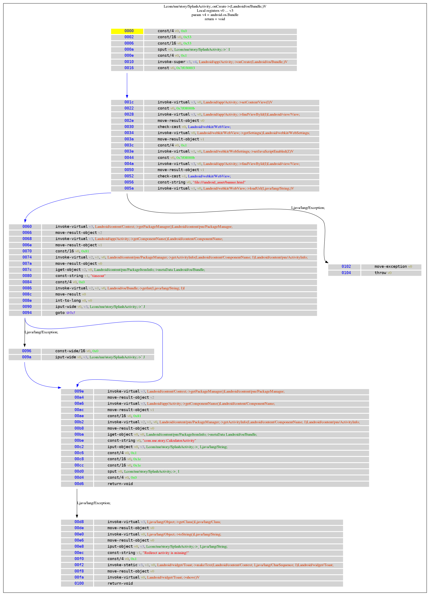

<<<<<<< HEAD
## What is Deoptfuscator

 asdkalsjdlkjalsd

+a
+b
+c
+d

## Prerequisites
In order to build and run deoptfuscator, the following are required:
+ Deoptfuscator based on Ubuntu 18.04 LTS 64bit PC
  +libboost, libjson (C++ library)
    +$sudo apt-get install libboost-all-dev
    +$sudo apt-get install libjsoncpp-dev
  +openjdk
    +$sudo apt-get install openjdk-11-jdk
  +i386 libc
    +$sudo dpkg --add-architecture i386
    +$sudo apt-get update
    +$sudo apt-get install libc6:i386 libstdc++6:i386
  +zipalign
    +$sudo apt-get install zipalign
  +apksigner
    +$sudo apt-get install apksigner

HOW TO USE
+Set Local Environment
  +$. ./launch.sh 
+Deobfuscate Android application which is applied control flow obfuscated technique
  +$python3 deoptfuscator.py <obfuscated_apk>
+Test our tools!
  +$python3 deoptfuscator.py test/Trolly_cf.apk
  +Deobfuscated apk will created named as [Trolly_cf_deobfuscated_align.apk]
+Our tool is effectively deobfuscate Android application as below : 
 

=======
# deoptfuscator
Deobfuscating android application
>>>>>>> ba891261290f45743d9bbe572c3d1dcab5ccecc8
